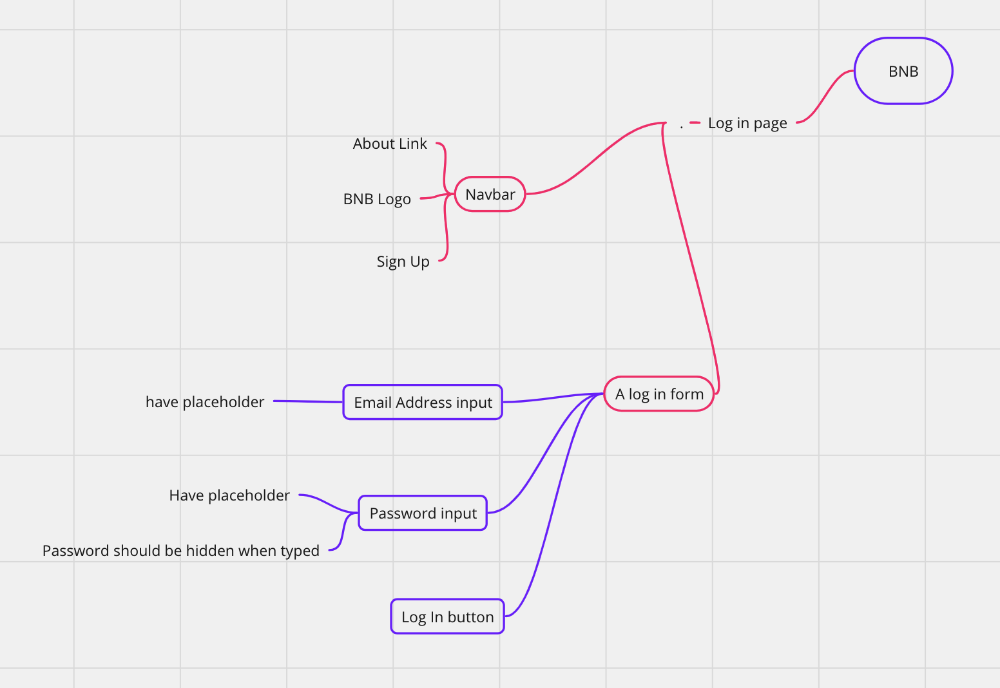

# BNB Testing

## Login Page - What users see


## Risks
```
- Should prevent SQL, crosse-site scripting or other brute force attacks
- Password not hidden when typed which could lead to security breach
- User can log in with incorrect details
- User can access account without logging in
- Logged in users should only be able to see their own account details
- User is using Internet Explorer!
- Cross-browser compatibility
- Device compatibility
```
## Login page - expected behaviours
```
- User should be able to input text in Email Address input
- User should be able to input text in the Password input
- The Password input should be hidden/obscured when typed
- The login button should submit the form
```
Dev considerations not relevant to this task as a tester
    - Validate email address (?)
    - DB request
    - Check email address in db
    - DB request
    - Check if password matches email's stored password
```
IF LOGIN SUCCESSFUL =>
- Home page renders as logged in user

IF LOGIN UNSUCCESSFUL => 
- Error message to indicate incorrect details entered
- Email address field to be left as it was
- Password filed to reset (?)
```

## Assumptions and Questions
- Is there any justification to validate the email address bearing in mind that it potentially saves a db query?
- Would the validation be done as two separate requests?

## Initial Exploratory Testing

### Areas to Explore

### Initial tests
