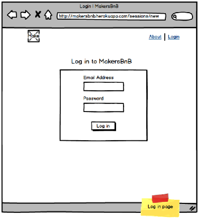
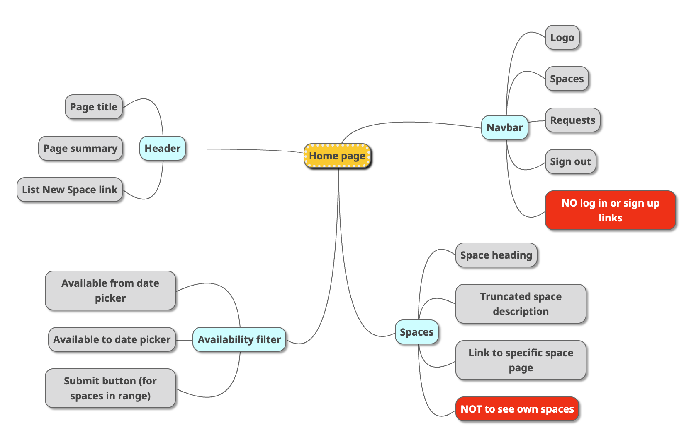

# BNB Testing

## Context
This is a Makers Quality Engineering exercise project for the [Intro to Testing pair test analysis](https://github.com/makersacademy/intro-to-testing/blob/main/phase3/05_pair_test_analysis_more.md) written by Romain Grudé and Pablo Joyce. 
It is a pre-exploratory test analysis of the [Makers BNB project](https://github.com/makersacademy/engineering-project-1/blob/main/specification.md) based on the Headline specifications and [wireframe mockups](https://github.com/makersacademy/engineering-project-1/blob/main/MakersBnB_mockups.pdf).
Having gone into some depth on the proceeding [Github issues exercise](https://github.com/makersacademy/intro-to-testing/blob/main/phase3/03_bug_reporting.md), given limited time and considering our particular learning needs, we made the pragmatic decision to verbally discuss the project at a high level and focus our report to a very specifc area of the project that was limited in scope but of interest from a testing perspective.

## Login Page - What users should see
This report is primarily concerned with the log in page.

These are the features that we expect the user to see when they navigate to the login page. Despite what is shown on the wireframe mockup, we would not expect to see a login link on the navabr but instead we would expect the user to see a signup link.


## Risks
```
- Should prevent SQL, crosse-site scripting or other brute force attacks
- Password not hidden when typed which could lead to security breach
- User can log in with incorrect details
- User can access account without logging in
- Logged in users should only be able to see their own account details
- User is using Internet Explorer!
- Cross-browser compatibility
- Device compatibility
- Poor responsive design
```
## Login page - expected behaviours
```
- User should be able to input text in Email Address input
- User should be able to input text in the Password input
- The Password input should be hidden/obscured when typed
- The login button should submit the form
```

```
IF LOGIN SUCCESSFUL =>
- Home page renders as logged in user

IF LOGIN UNSUCCESSFUL => 
- Error message to indicate incorrect details entered
- Email address field to be left as it was
- Password filed to reset (?)
```
During this process we began looking at the mechanics of what was happening behind the scenes. These are developer considerations that we decided were interesting but not relevant to this task in our role as a testers.
```    - Validate email address (?)
    - DB request
    - Check email address in db
    - DB request
    - Check if password matches email's stored password
```
So we decided to stick to out expectations of what should happen rather than making decisions about how it should happen.

## Assumptions and Questions
```
- Will input fields have placeholders
- Navbar should have a signup link but not a login link
- We have valid login credentials for a signed up user
```
As with the expected behaviours, we had started to look into the developer mechanics rather than sticking to expected behaviours. In cases such as validating the email, there is a potential change in expected behaviour.
```
- Is there any justification to validate the email address bearing in mind that it potentially saves a db query?
- Would the validation be done as two separate requests?
```

## Initial Exploratory Testing
Our initial 90 minute exploratory testing session will focus on expected beahviours in the login page and what we expect when both successful and unsuccessful log in attempts are made.

### Initial tests
```
Valid Login Credentials:
Input: Valid email (e.g., user@example.com), valid password (e.g., SecurePass123) and Click Log In button.
Expected Result: Successful login navigates to logged in user home page with the following features:
```

```
Invalid Email:
Input: Invalid email format - missing '@', valid password and Click Log In button.
Expected Result: Appropriate error message for invalid email.
```
```
Invalid Email:
Input: Invalid email format - Invalid domain 'x.x', valid password and Click Log In button.
Expected Result: Appropriate error message for invalid email.
```
```
Invalid Email:
Input: Invalid email format - additional '@@', valid password and Click Log In button.
Expected Result: Appropriate error message for invalid email.
```
```
Empty Email Field:
Input: Empty email field, valid password and Click Log In button.
Expected Result: Highlighted empty email field with a request for input.
```
```
Empty Password Field:
Input: Empty password field, valid email and Click Log In button.
Expected Result: Highlighted empty password field with a request for input.
```
```
Incorrect Credentials:
Input: Valid email (e.g., user@example.com) with an incorrect password (input: incorrect_password).
Expected Result: Error message for incorrect login credentials.
```
```
Caps Lock Warning:
Input: Password with Caps Lock activated (input: CaPsLoCkOn123).
Expected Result: Warning message indicating Caps Lock is on.
```
```
Browser Auto-fill:
Input: Browser auto-fill for the login form.
Expected Result: Correct processing and login with auto-filled credentials.
```
```
Session Timeout:
Input: Log in and wait for session timeout.
Expected Result: Redirect to the login page, requiring reauthentication.
```
```
Brute Force Protection:
Input: Multiple consecutive failed login attempts.
Expected Result: Account lockout or enforced delay for additional security.
```
```
Cross-browser Compatibility:
Input: Test login page on different browsers (e.g., Chrome, Firefox, Safari, Edge).
Expected Result: Consistent functionality and appearance across browsers except for Internet Explorer.
```
```
Responsive Design:
Input: Access login page from various devices (desktop, tablet, mobile).
Expected Result: Responsive and functional layout on different screen sizes.
```
```
Securuty Headers and Input Validation:
Input: Attempt login with inputs containing cross-site scripting (XSS), SQL injection, and special characters.
Expected Result: Robust input validation, prevention of XSS and SQL injection, and proper character escaping.
```
